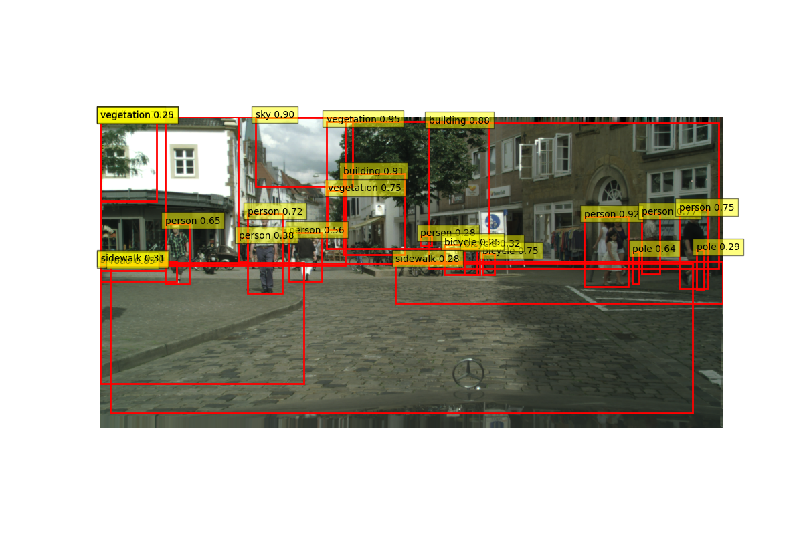

# Traffic-Detection-Website
Hi, this is my demo personal project for seeking a job.
Here are some instructions and relevant links for my project.
## Relevant link:
### Dataset (use only "leftImg8bit" and "gtFine"): https://www.cityscapes-dataset.com/
### Models: https://github.com/Wang199x/Traffic-Detection-Website/releases
### Demo image:

## Training and testing phases step by step:
### create_mask.py: create object masks for traffic images.
### annotation.py: create YOLO annotation based on masks from create_mask.py.
### move_imgs.ps1: move images and annotations into the same folder and modify follow the YOLO format.
### change_name.py: change images name to be matched to the labels.
### data.yaml: yaml file for YOLO (included dataset and label path, number of classes and class name).
### training.py: training YOLOv8 file using data.yaml.
### testing_image.py: test with your own image or you can use the test folder from the Cityscape dataset to test. 
## Website: just change directory (cd) to "app" and use “flask run” command and follow instruction on homepage.
### app.py: main file (include routes, request process, database connection) to run the web application.
### services.py: main processes for testing images based on the trained YOLOv8x model.
### templates: include 4 html file for different interfaces.
### static: include js (Javascript), css (Cascading Style Sheets) and web images folder
## Other files:
### contour.py: create bounding boxes for masks.
### cuda.py: check if you have CUDA Pytorch for GPU uses.
### data_analysis.py: counting images number for train, val and objects numbers.
### label_define.py: labels definition for Cityscape dataset
### requirement.txt: libararies requirement for my project
# ======================================================
# My information and contacts:
### LinkedIn: https://www.linkedin.com/in/nhat-quang-dang-5905b22b9/
### Email: quangdn1801@gmail.com
# ======================================================
# I hope I can find a job soon, thank you for reading!
